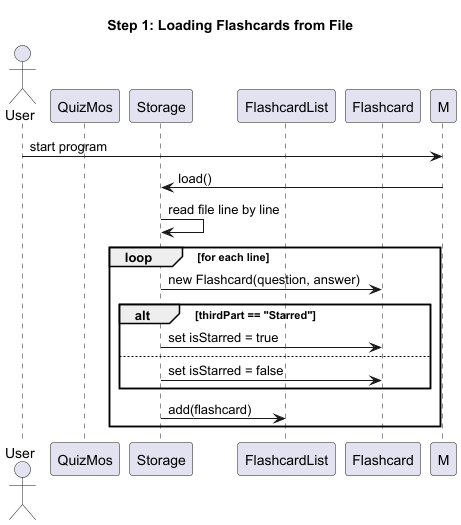
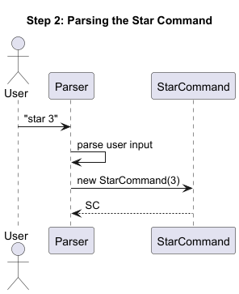
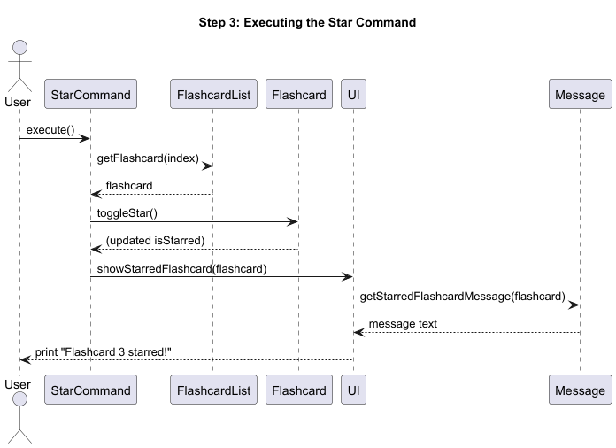
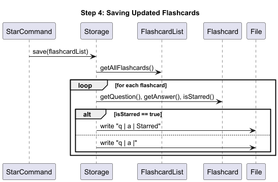
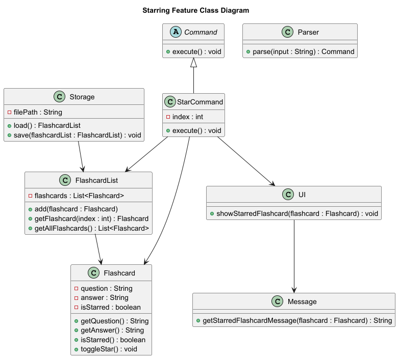

# Developer Guide

## Acknowledgements

{list here sources of all reused/adapted ideas, code, documentation, and third-party libraries -- include links to the original source as well}

## Design & implementation

{Describe the design and implementation of the product. Use UML diagrams and short code snippets where applicable.}

---

## Starring Flashcards Feature

### Overview

The starring feature allows users to **mark important flashcards** as “starred” for easier review. A starred flashcard is indicated by the `isStarred` attribute in the `Flashcard` class.

This feature is made possible by the following components:

- **Storage**: Handles reading and writing flashcards (including their `isStarred` status) from and to a text file.
- **Flashcard**: Represents a single flashcard, with an additional `isStarred` attribute and `toggleStar()` method.
- **FlashcardList**: Manages a list of flashcards.
- **Parser**: Parses user input and creates corresponding `Command` objects.
- **StarCommand**: Toggles the `isStarred` status of a flashcard at the specified index.
- **UI**: Displays the result of starring actions to the user.
- **Message**: Stores user-facing message templates.

---

### Step 1. Loading Flashcards from File

When the user starts the application, the `Storage` class loads flashcards from a text file.  
Each line in the file follows the format:

`Question | Answer | Starred`

or

`Question | Answer |`

The `Storage#load()` method:

1. Reads each line.
2. Splits it by `|`.
3. Creates a new `Flashcard` instance.
4. Sets `isStarred` to `true` if the third part equals `"Starred"`.
5. Adds the `Flashcard` to a `FlashcardList`.

---

### Step 2. Parsing the Star Command

When a user enters:

`star 3`

The `Parser` class:

1. Identifies that the command keyword is `"star"`.
2. Extracts the index argument (`3`).
3. Creates a new `StarCommand(index)` instance.

---

### Step 3. Executing the Star Command

When executed, the `StarCommand`:

1. Retrieves the `Flashcard` from the `FlashcardList` at the specified index.
2. Calls the flashcard’s `toggleStar()` method to flip its status.
3. Calls `UI#showStarredFlashcard(flashcard)` to display the confirmation message.

---

### Step 4. Saving Updated Flashcards

After the star operation, the application calls `Storage#save()` to persist the updated flashcard states.

The `Storage#save()` method:

1. Iterates through each flashcard in the list.
2. Writes its question, answer, and `"Starred"` (if `isStarred` is true) back to the text file.

---

### Full Class Diagram for Implementation of Starring Feature

---

## Product scope

### Target user profile

{Describe the target user profile}

### Value proposition

{Describe the value proposition: what problem does it solve?}

## User Stories

|Version| As a ... | I want to ... | So that I can ...|
|--------|----------|---------------|------------------|
|v1.0|new user|see usage instructions|refer to them when I forget how to use the application|
|v2.0|user|find a to-do item by name|locate a to-do without having to go through the entire list|

## Non-Functional Requirements

{Give non-functional requirements}

## Glossary

* *glossary item* - Definition

## Instructions for manual testing

{Give instructions on how to do a manual product testing e.g., how to load sample data to be used for testing}
