# Developer Guide

---

## Table of Contents

1. [Acknowledgements](#acknowledgements)
2. [Design](#design)
   - [Architecture](#architecture)
   - [UI Component](#ui-component)
   - [Logic Component](#logic-component)
   - [Model Component](#model-component)
   - [Main Component](#main-component)
   - [Storage Component](#storage-component)
   - [Commons Component](#commons-component)
3. [Implementation](#implementation)
   - [Feature 1: Add Flashcard](#feature-1-add-flashcard)
   - [Feature 2: Delete Flashcard](#feature-2-delete-flashcard)
   - [Feature 3: Search Flashcard](#feature-3-search-flashcard)
   - [Feature 4: Review Flashcards](#feature-4-review-flashcards)
   - [Feature 5: Star Flashcard](#feature-5-star-flashcard)
   - [Feature 6: Unstar Flashcard](#feature-6-unstar-flashcard)
   - [Feature 7: Get Starred Flashcards](#feature-7-get-starred-flashcards)
   - [Feature 8: Edit Flashcards](#feature-7-get-starred-flashcards)
4. [Requirements](#requirements)
   - [User Stories](#user-stories)
   - [Use Cases](#use-cases)
   - [Non-Functional Requirements (NFRs)](#non-functional-requirements-nfrs)
   - [Glossary](#glossary)
5. [Instructions for Manual Testing](#instructions-for-manual-testing)
   - [Launching the Application](#launching-the-application)
   - [Add Command](#add-command)
   - [List Command](#list-command)
   - [Delete Command](#delete-command)
   - [Search Command](#search-command)
   - [Review Command](#review-command)
   - [Star Command](#star-command)
   - [Unstar Command](#unstar-command)
   - [GetStar Command](#getstar-command)
   - [ِEdit Command](#getstar-command)
   - [Help Command](#help-command)
   - [Exit Command](#exit-command)
   - [General Edge Cases](#general-edge-cases)

---

## Acknowledgements

- [JUnit 5](https://junit.org/) - For unit testing.
- [Gradle](https://gradle.org/) - For build automation.
- [PlantUML](https://plantuml.com/) - For creating UML diagrams.

---

## Design

### Architecture

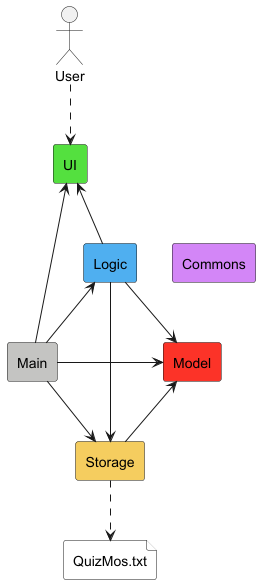

The **_Architecture Diagram_** given above explains the high-level design of the App.

- `Main`: Launch app and shut down
  - At app launch, it initializes the other components in the correct sequence, and connects them up with each other.
  - At shut down, it shuts down the other components.
- `UI`: The UI of the App, in charge of print out information in format.
- `Logic`: The Command parser and executor.
- `Model`: Stores data of the App in memory.
- `Storage`: Reads data from, and writes data to, the hard disk.

The sections below give more details of each component

### UI Component

**Responsibilities:**
- Handles all user interactions via the console.
- Reads user input commands for processing by the `Logic` component.
- Displays formatted messages, prompts, separators, and errors.
- Provides a test mode for automated testing where ANSI colors are disabled.
- Interacts with `Flashcard` objects from the `Model` component to display data.

**Classes:**
- `Ui`: Provides methods to read user input, display messages, prompts, errors, and separators. Supports both normal and test modes for consistent UI behavior.
- `Messages`: Stores common string messages and separators used across the UI for consistent formatting and display.

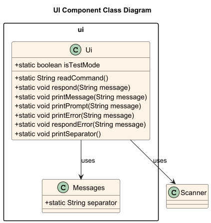

### Logic Component
**Responsibilities:**
- Run the main application loop, handling continuous command input.
- Parse the raw command, then execute the resulting Command object.
- Catch and handle exceptions thrown during command parsing or execution.
- Execute `Command` objects to indirectly interact with the Model (`FlashcardList`).

**Classes:**
- `QuizMos`: Runs the main loop, reads user input from UI, sends the raw command to Parser, and executes the returned Command object.
- `Parser`: Parses the raw input string, validates format, extracts arguments, and returns the appropriate concrete Command object, or throws a specific exception.
- `Command`: Abstract class for other command classes
  - `AddFlashcardCommand`
  - `ExitCommand`
  - `GetStarCommand`
  - `HelpCommand`
  - `ListCommand`
  - `RemoveFlashcardCommand`
  - `ReviewCommand`
  - `SearchFlashcardCommand`
  - `StarCommand`
  - `UnstarCommand`
- `IReviewMode`: Interface for different review modes
  - `MultipleChoiceReview`
  - `SimpleFlipReview`
  - `TrueFalseReview`

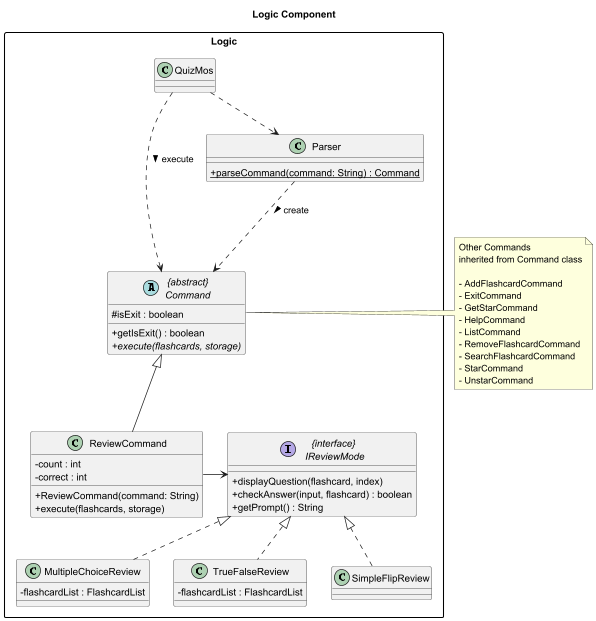
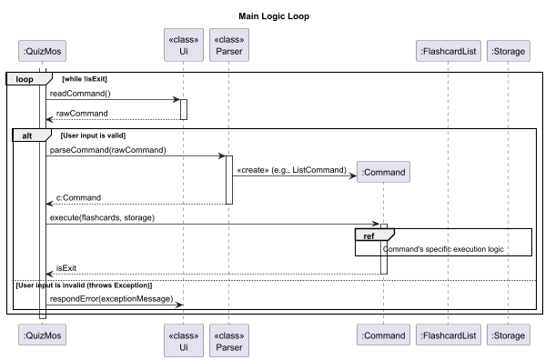

### Model Component

**Responsibilities:**
- Manages the in-memory representation of flashcards.
- Provides methods to add, delete, and search flashcards.

**Classes:**
- **`Flashcard`** — Represents a single flashcard containing a question and answer pair, with support for marking it as starred.
- **`FlashcardList`** — Manages a collection of flashcards, providing methods to add, remove, retrieve, and list flashcards, as well as filter starred ones.

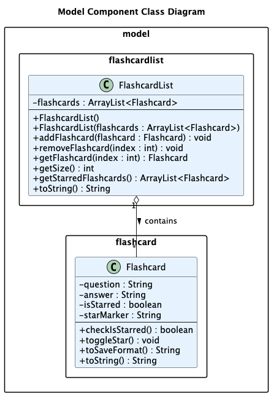

### Main Component

**Responsibilities:**
- Initializes the application.
- Coordinates between UI, Logic, and Storage components.

**Class:**
- **`QuizMos`** — The main entry point of the application. Handles setup, command parsing, and orchestrates the overall program flow.

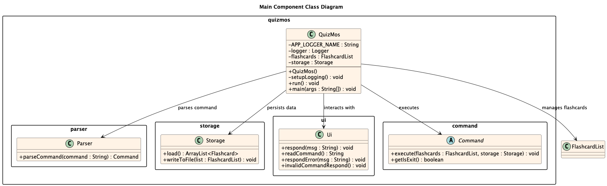

### Storage Component
**Responsibilities:**
- Reads flashcard data from the storage file into memory.
- Writes updated flashcard data from memory back to the storage file.
- Ensures that the storage file and its parent directories exist, creating them if necessary.
- Handles file-related exceptions and logs operations for debugging purposes.
- Works with `Flashcard` and `FlashcardList` objects from the `Model` component.

**Classes:**
- `Storage`: Manages persistence of flashcards; reads from and writes to the storage file, ensures file existence, handles exceptions, and interacts with `Flashcard` and `FlashcardList`.

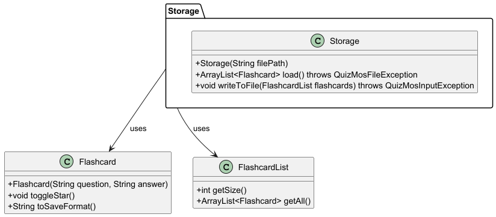

### Commons Component

**Responsibilities:**
- Contains shared classes used by multiple components (e.g., Messages, Exceptions).

**Class:**
- **`QuizMosException`** — The base exception class for all application-specific errors.
- **`QuizMosFileException`** — Thrown when file read/write operations fail.
- **`QuizMosInputException`** — Thrown when user input is invalid or cannot be processed.
- **`QuizMosLogicException`** — Thrown when logical errors occur during command execution.
- **`Messages`** — Stores general UI and command-related messages.
- **`FlashcardMessages`** — Provides user-facing messages for flashcard-related operations.
- **`FlashcardListMessages`** — Contains messages related to the flashcard list state.
- **`ReviewMessages`** — Provides messages and prompts used during the flashcard review sessions.

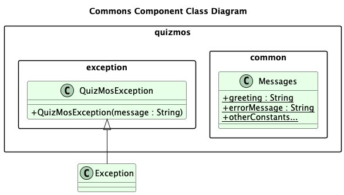

---

## Implementation

This section describes some noteworthy details on how certain features are implemented.

### Feature 1: Add Flashcard

**Command:** `add q/<question> a/<answer>`

**Explanation:** 
- The `Parser` identifies the add command and creates a new `AddFlashcardCommand`.
- The `AddFlashcardCommand` parses the user input.
- Validates that both question and answer fields are valid.
- Adds a new flashcard to the `FlashcardList` and saves it via `Storage`.
- Calls the `Ui` to display the flashcard was added.

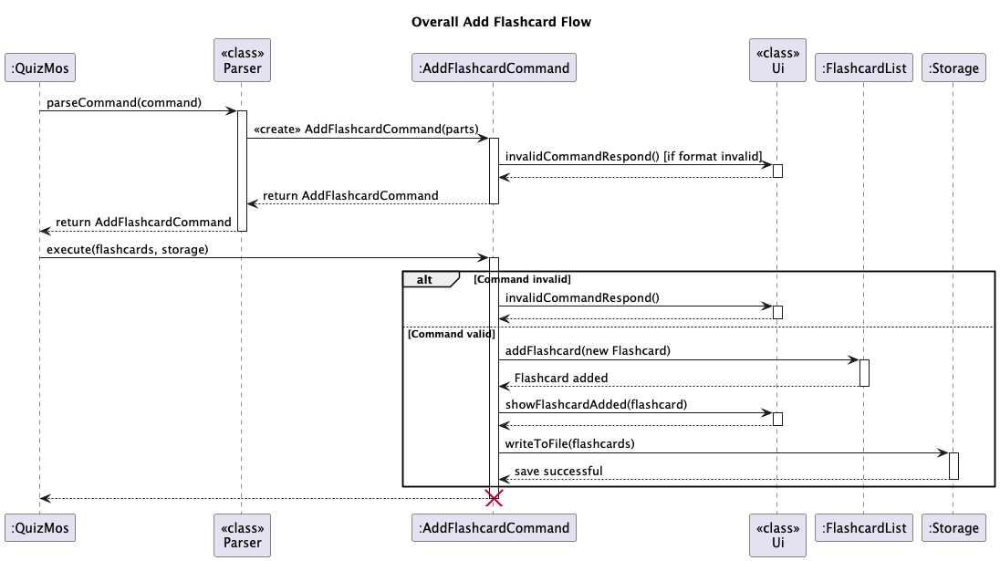

### Feature 2: Delete Flashcard

**Command:** `delete <index>`

**Explanation:**
- The `Parser` identifies the delete command and creates a new `RemoveFlashcardCommand`.
- The `RemoveFlashcardCommand` parses the user input.
- Validates that the index is valid.
- Removes the flashcard and updates the `FlashcardList`.
- Calls the `Ui` to display the flashcard was removed.

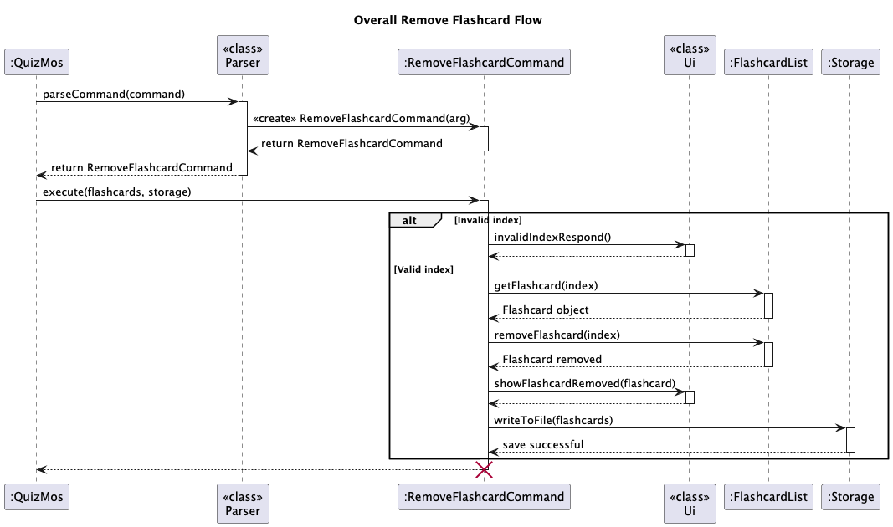

### Feature 3: Search Flashcard

**Command:** `search <keyphrase>`

**Explanation:**
- The `Parser` identifies the search command and creates a new `SearchFlashcardCommand`.
- The `SearchFlashcardCommand` parses the user input.
- Validates that the keyphrase is valid.
- Searches through all flashcards for matching keywords in question or answer.
- Displays a list of matches or an error if none are found.

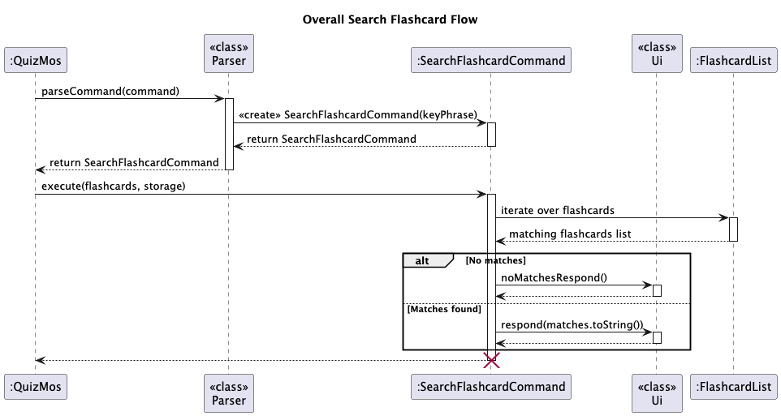

### Feature 4: Review Flashcards

**Command:** `review m/[FLIP  \| TF \| MCQ]`

**Explanation:**
- The `Parser` instantiates `ReviewCommand`, which immediately parses and validates the mode from the user's input.
- The `execute()` method first verifies the `FlashcardList` isn't empty. It then calls `setReviewMode()` to dynamically create and assign the correct review object (e.g., `MultipleChoiceReview`) for the review mode.
- The `reviewLoop()` iterates through the flashcards, performing three actions per card via the `reviewMode` object:
  1. Display: Shows the question (mode-specific formatting included).
  2. Input: Retrieves the user's answer (or breaks the loop if the input is `quit`). 
  3. Resolution: Checks the answer via `checkAnswer()` and updates the correct counter.
- Eventually, the `quitReview()` method displays the session summary, including total cards reviewed and final results (for non-flip modes).

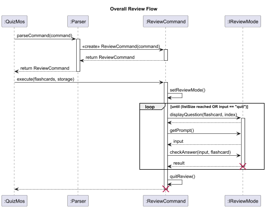

- **Flip mode flow**
  - The App displays the question only.
  - The user is prompted (y/n) to reveal the answer.
  - `checkAnswer()` simply prints the answer if the user input is 'y'. No score tracking is done, as the user dictates correctness.
- **MCQ mode flow**
  - `displayQuestion()` first calls the `listOfChoices()` helper method. This method generates a list of four unique random indices (include the correct one).
  - The App tracks the correct answer's index internally.
  - `checkAnswer()` checks the user's input (1–4) against the internal correct index and updates the score.
- **TF mode flow**
  - `displayQuestion()` presents the flashcard's question paired with an answer that is randomly selected from the entire `FlashcardList`.
  - `currentAnswer` is set to `true` (default is `false`) if the random answer matches the correct answer.
  - The user inputs `t` or `f`. `checkAnswer()` compares the user's input with the pre-determined `currentAnswer` boolean to evaluate correctness and updates the score.
     
### Feature 5: Star Flashcard

**Command:** `star <index>`

**Explanation:**
- The `Parser` identifies the `star` command and creates a new `StarCommand` object.
- The `StarCommand` parses the user input and converts the provided index to a zero-based integer.
- Validates that the index is within the range of existing flashcards in the `FlashcardList`.
- Retrieves the corresponding `Flashcard` object using the validated index.
- Checks if the flashcard is already starred. If yes, an error is raised through `QuizMosInputException`.
- If not starred, the command toggles its starred status via `toggleStar()` and adds it to the list of starred flashcards.
- Displays a confirmation message using the `Ui` component, leveraging `FlashcardMessages` for consistent formatting.
- Persists the updated `FlashcardList` to storage using the `Storage` component.
- Logs key execution steps (validation, starring, saving) for debugging and traceability.

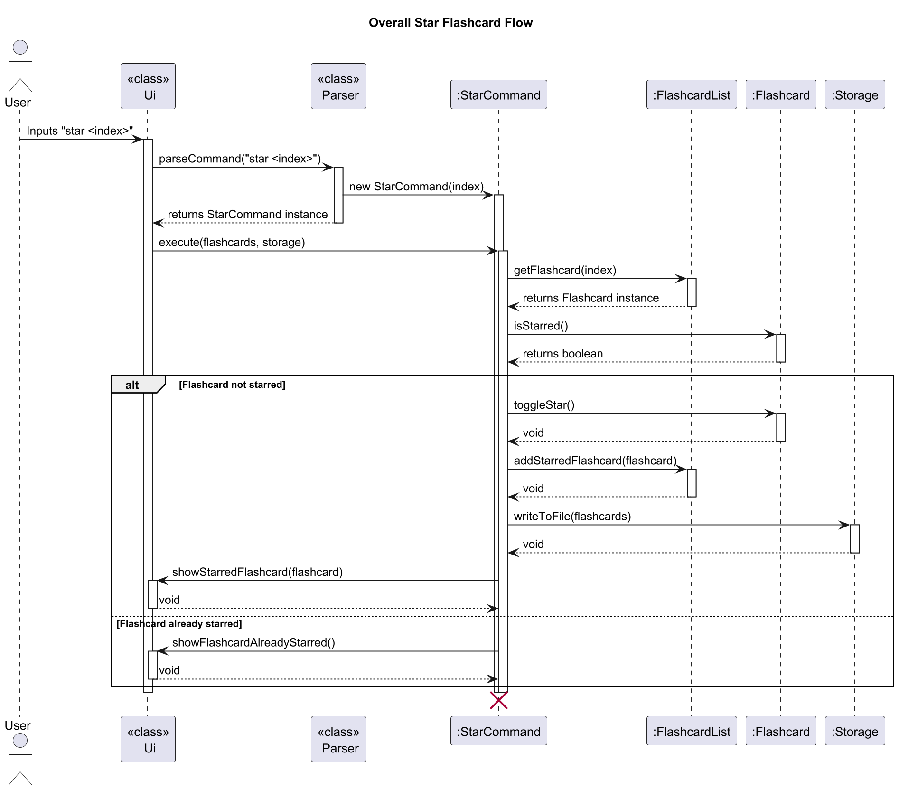

### Feature 6: Unstar Flashcard

**Command:** `unstar <index>`

**Explanation:**
- The `Parser` identifies the `unstar` command and creates a new `UnstarCommand` object.
- The `UnstarCommand` parses the user input and converts the provided index to a zero-based integer.
- Validates that the index is within the range of existing flashcards in the `FlashcardList`.
- Retrieves the corresponding `Flashcard` object using the validated index.
- Checks if the flashcard is already unstarred. If yes, an error is raised through `QuizMosInputException`.
- If starred, the command toggles its starred status via `toggleStar()` and removes it from the list of starred flashcards.
- Displays a confirmation message using the `Ui` component, leveraging `FlashcardMessages` for consistent formatting.
- Persists the updated `FlashcardList` to storage using the `Storage` component.
- Logs key execution steps (validation, unstarring, saving) for debugging and traceability.

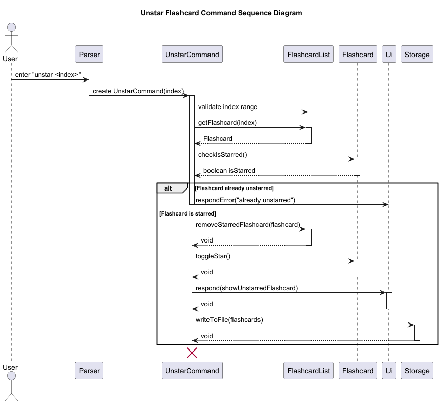

### Feature 7: Get Starred Flashcards
**Command:** `getstar`

**Responsibilities / Explanation:**
- The `Parser` identifies the `getstar` command and creates a new `GetStarCommand` object.
- The `GetStarCommand` retrieves all starred flashcards from the `FlashcardList` using `getStarredFlashcardsString()`.
- Performs internal assertions to ensure the returned string is not `null`.
- Uses the `Ui` component to display the list of starred flashcards via `FlashcardListMessages.showStarredFlashcardsList()`.
- Does not modify the `FlashcardList` or `Storage`; this is a read-only command.
- Logs key execution steps for debugging and traceability.

**Classes:**
- `GetStarCommand`
- `FlashcardList`
- `Ui`
- `FlashcardListMessages`
- `Storage` (reference only, no writes)

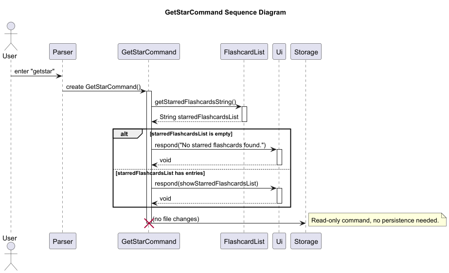

### Feature 8: Edit Flashcards
**Command:** `edit <index>`

**Responsibilities / Explanation:**
- The `Parser` identifies the `edit` command and creates a new `EditFlashcardCommand` object.
- The `EditFlashcardCommand` parses and validates the provided index.
- Retrieves the target flashcard from the `FlashcardList` using `getFlashcard(index)`.
- Uses the Ui component to:
  - Display the current question and prompt for a new one.
  - Display the current answer and prompt for a new one.
- Compares the new input with the existing flashcard content.
- If changes are detected:
  - Updates the flashcard’s question and/or answer. 
  - Saves the updated list to disk via `Storage.writeToFile()`. 
  - Displays a confirmation message using `Ui.respond()`.
- If no changes are made:
  - Displays a message indicating no updates were applied.
- Performs internal assertions to ensure FlashcardList and Storage are not null.


**Classes:**
- `EditFlashcardCommand`
- `FlashcardList`
- `Flashcard`
- `Ui`
- `Storage`


---

## Requirements

### User Stories

| Version | As a... | I want to... | So that I can... |
| :--- | :--- | :--- | :--- |
| v1.0 | new user | go through a series of instructions | refer to them when I forget how to use the application |
| v1.0 | new user | see usage instructions | I know how to use the app |
| v1.0 | user | view list of flashcards overall | I can see every flashcard created |
| v1.0 | user | remove flashcards | I can keep my deck organized and make sure unnecessary cards are removed |
| v1.0 | user | add a flashcard with a question and answer | I can revise the material later |
| v1.0 | user | save my flashcards locally | I can reuse flashcards |
| v1.0 | user | do review | I can review my knowledge |
| v2.0 | user | find a to-do item by name | locate a to-do without having to go through the entire list |
| v2.0 | user | star/flag flash cards which are important | I can review by categories |
| v2.0 | new user | add the list of flashcards through a txt file | I start using the app more quickly |
| v2.0 | user | add multiple choice type questions | I can test my knowledge in different ways |
| v2.0 | user | add true/false type questions | I can test my knowledge in different ways |
| v2.0 | user | search for a specific flashcard by keyword | I can quickly find and revise a concept |
| v2.0 | user | mark my answers as correct or incorrect during quizzes | the app can track my progress |

### Use Cases

**(For all use cases below, the **System** is **QuizMos** and the **Actor** is the **User**, unless specified otherwise.)**

#### **Use case: Add a Flashcard (`add`)**

**Goal:** User adds a new question and answer pair to the study list. **Command:** `add q/QUESTION a/ANSWER`

**MSS (Main Success Scenario)**

1.  User requests to add a flashcard with a valid question and answer.

2.  QuizMos creates the new Flashcard object.

3.  QuizMos adds the Flashcard to the `FlashcardList` and saves the updated list to storage.

4.  QuizMos displays a confirmation message showing the new Flashcard details. Use case ends.


**Extensions** 
- 1a. User forgets question or answer (`q/` or `a/` missing or empty). 
- 1a1. QuizMos displays an input error message. Use case ends.

#### **Use case: Delete a Flashcard (`delete`)**

**Goal:** User removes a specific flashcard from the study list. **Command:** `delete INDEX`

**MSS (Main Success Scenario)**

1.  User requests to delete a specific flashcard by providing a valid index.

2.  QuizMos removes the Flashcard from the `FlashcardList`.

3.  QuizMos saves the updated list to storage.

4.  QuizMos displays a confirmation message showing the deleted Flashcard. Use case ends.


**Extensions** 
- 1a. The given index is invalid (e.g., negative, non-numeric, or out of range). 
- 1a1. QuizMos displays an error message. Use case resumes at step 1.

#### **Use case: Start a Review Session (`review`)**

**Goal:** User tests their memory using a specific review mode (FLIP, TF, or MCQ). **Command:** `review m/[FLIP | TF | MCQ]`

**MSS (Main Success Scenario)**

1.  User requests to start a review session with a valid mode.

2.  QuizMos initializes the correct review strategy object (`IReviewMode`).

3.  **(Loop)** QuizMos iterates through the list, displays the question (mode-specific format).

4.  User inputs an answer (`y/n`, `t/f`, `1-4`) or `quit`.

5.  QuizMos processes the input, checks the answer (if applicable to mode), updates the score, and displays feedback.

6.  **(Loop)** QuizMos repeats from step 3 for the next flashcard.

7.  Review session ends (all cards reviewed).

8.  QuizMos displays a summary including total reviewed and score (for non-FLIP modes). Use case ends.


**Extensions** 
- 1a. The `FlashcardList` is empty. 
- 1a1. QuizMos displays an error message (_Review list is empty_). Use case ends. 
- 1b. MCQ mode requested, but less than 4 flashcards exist. 
- 1b1. QuizMos displays an error message (_MCQ requires at least 4 flashcards_). Use case ends. 
- 4a. User inputs `quit` at any time. 
- 4a1. QuizMos jumps to step 7 (display summary of cards reviewed so far). Use case ends. 
- 4b. User inputs an invalid format/choice for the current mode. 4b1. QuizMos displays an input error and repeats step 4. Use case resumes at step 4.

#### **Use case: Star a Flashcard (`star`)**

**Goal:** User marks a flashcard as important or difficult. **Command:** `star INDEX`

**MSS (Main Success Scenario)**

1.  User requests to star a flashcard by providing a valid index.

2.  QuizMos retrieves the Flashcard and updates its status to **starred**.

3.  QuizMos updates the list of starred Flashcards and saves the changes to storage.

4.  QuizMos displays a confirmation message for the starred Flashcard. Use case ends.


**Extensions** 
- 1a. The given index is invalid (e.g., out of range). 
- 1a1. QuizMos displays an error message. Use case resumes at step 1. 
- 2a. The Flashcard at the given index is already starred. 
- 2a1. QuizMos displays a warning message. Use case ends.

#### **Use case: Unstar a Flashcard (`unstar`)**

**Goal:** User removes the important/starred flag from a flashcard. **Command:** `unstar INDEX`

**MSS (Main Success Scenario)**

1.  User requests to unstar a flashcard by providing a valid index.

2.  QuizMos retrieves the Flashcard and updates its status to **unstarred**.

3.  QuizMos removes the Flashcard from the list of starred Flashcards and saves the changes to storage.

4.  QuizMos displays a confirmation message for the unstarred Flashcard. Use case ends.


**Extensions** 
- 1a. The given index is invalid. 1a1. QuizMos displays an error message. Use case resumes at step 1. 
- 2a. The Flashcard at the given index is not currently starred. 
- 2a1. QuizMos displays a warning message. Use case ends.

#### **Use case: Retrieve Starred Flashcards (`getstar`)**

**Goal:** User views only the flashcards they have marked as important. **Command:** `getstar`

**MSS (Main Success Scenario)**

1.  User requests to retrieve all starred flashcards.

2.  QuizMos retrieves the list of starred Flashcards from the `FlashcardList`.

3.  QuizMos displays the list of starred flashcards. Use case ends.


**Extensions** 
- 2a. The list of starred flashcards is empty. 
- 2a1. QuizMos displays a message indicating that there are no starred flashcards. Use case ends.

#### **Use case: Search Flashcards (`search`)**

**Goal:** User finds flashcards containing a specific keyword or keyphrase. **Command:** `search KEYPHRASE`

**MSS (Main Success Scenario)**

1.  User requests to search the list by providing a valid keyphrase.

2.  QuizMos searches through all flashcards for matches in both the question and answer fields.

3.  QuizMos displays a list of the matching flashcards. Use case ends.


**Extensions** 
- 1a. The keyphrase is empty. 
- 1a1. QuizMos displays an error message (_Keyphrase cannot be empty_). Use case ends. 
- 3a. No flashcards match the provided keyphrase. 
- 3a1. QuizMos displays a message indicating no matches were found. Use case ends.

#### **Use case: List All Flashcards (`list`)**

**Goal:** User gets an overview of all flashcards in the study list. **Command:** `list`

**MSS (Main Success Scenario)**

1.  User requests to list all flashcards.

2.  QuizMos retrieves the entire `FlashcardList`.

3.  QuizMos displays the full list of flashcards, including their index and star status. Use case ends.


**Extensions** 
- 2a. The `FlashcardList` is empty. 
- 2a1. QuizMos displays a message indicating that the list is currently empty. Use case ends.

#### **Use case: View Help (`help`)**

**Goal:** User gets usage instructions for all commands. **Command:** `help`

**MSS (Main Success Scenario)**

1.  User requests help.

2.  QuizMos displays a list of all available command formats and their descriptions. Use case ends.


**Extensions** (None)

#### **Use case: Exit Application (`exit`)**

**Goal:** User closes the application safely. **Command:** `exit`

**MSS (Main Success Scenario)**

1.  User requests to exit the application.

2.  QuizMos saves the current `FlashcardList` to storage (if any unsaved changes exist).

3.  QuizMos displays a farewell message.

4.  The application terminates gracefully. Use case ends.


**Extensions** (None)

### Non-Functional Requirements (NFRs)
- The display of the next question and answer resolution must occur within 500 milliseconds per card.
- The App must prevent the start of any review session if the `FlashcardList` is empty, throwing an appropriate exception.
- The application must prohibit starting MCQ review if the `FlashcardList` contains fewer than 4 flashcards.
- All review mode prompts must perform immediate input validation and provide clear, specific error messages for incorrect choices.
- The review session must guarantee a graceful exit upon receiving the `quit` command, regardless of the user's progress in the loop.

---

## Glossary
- **FLIP mode:** A basic mode where the user views the question and manually chooses whether or not to reveal the answer.
- **MCQ mode (Multi-choice questions):** A mode that presents the user with four answer choices (including the correct one), forcing them to select one number. Requires at least four flashcards in the list.
- **TF mode:** A mode where a flashcard's question is paired with a randomly selected answer (which may or may not be correct). The user must decide if the resulting statement is true or false.

---

## Instructions for Manual Testing

### Launching the Application

**Prerequisites**
- Java 17 or higher installed.
- `quizmos.jar` is placed in a working directory.

**Steps**
1. Download the file `quizmos.jar`.
2. Open the terminal.
3. Navigate (`cd`) to the directory containing `quizmos.jar`.
4. Run:
```bash 
java -jar quizmos.jar
``` 

### Below are basic manual test cases for each feature, including correct usage and common edge cases.

### **Add Command**

**Correct Cases**
- `add q/What is 2+2? a/4`
- `add q/Capital of France a/Paris`

**Edge Cases**
- `add q/OnlyQuestion` (missing answer)
- `add a/OnlyAnswer` (missing question)
- `add q/ a/` (empty fields)

### **List Command**

**Correct Case**
- `list`

**Edge Cases**
- Run `list` when no flashcards exist (should show “No flashcards found”)


### **Delete Command**

**Correct Case**
- `delete 1`

**Edge Cases**
- `delete 0`
- `delete 9999` (index out of range)
- `delete abc` (invalid input)

### **Search Command**

**Correct Cases**
- `search 4`
- `search France`

**Edge Cases**
- `search` (no keyword)
- `search   ` (empty keyword)
- `search xyz` (no matches)

### **Review Command**

**Correct Cases**
- `review m/FLIP`
- `review m/TF`
- `review m/MCQ`

**Edge Cases**
- `review` (missing mode)
- `review m/INVALID` (invalid mode)
- `review m/MCQ` when fewer than 4 flashcards exist

### **Star Command**

**Correct Case**
- `star 1`

**Edge Cases**
- `star 0`
- `star 9999`
- `star abc`

### **Unstar Command**

**Correct Case**
- `unstar 1`

**Edge Cases**
- `unstar 0`
- `unstar 9999`
- `unstar abc`

### **GetStar Command**

**Correct Cases**
- `getstar` (when starred flashcards exist)

**Edge Cases**
- `getstar` (no starred flashcards)

### **Edit Command**

**Correct Cases**
- `edit 1` (edits the first flashcard)
- `edit 2` (edits the second flashcard)

**Edge Cases**
- `edit 0` (invalid index: out of bounds)
- `edit 9999` (invalid index: out of bounds)
- `edit abc` (invalid input: not a number)
- `edit` (missing index)
- `edit -1` (negative index)
- Provide empty input when prompted for new question/answer (should show “No changes made”)

### **Help Command**

**Correct Case**
- `help`

### **Exit Command**

**Correct Case**
- `exit`

### **General Edge Cases**
- Typing an unknown command (e.g., `randomCommand`)
- Missing prefixes (e.g., `add What is 2+2? 4`)
- Commands with extra spaces (should still work properly)

---

