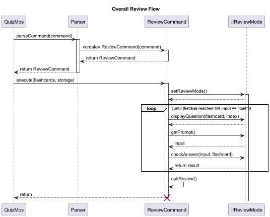

# Developer Guide

---

## Table of Contents

1. [Acknowledgements](#acknowledgements)
2. [Design](#design)
   - [Architecture](#architecture)
   - [UI Component](#ui-component)
   - [Logic Component](#logic-component)
   - [Model Component](#model-component)
   - [Main Component](#main-component)
   - [Storage Component](#storage-component)
   - [Commons Component](#commons-component)
   - [Overall Architecture Diagram](#overall-architecture-diagram)
3. [Implementation](#implementation)
   - [Feature 1: Add Flashcard](#feature-1-add-flashcard)
   - [Feature 2: Delete Flashcard](#feature-2-delete-flashcard)
   - [Feature 3: Search Flashcard](#feature-3-search-flashcard)
   - [Feature 4: Review Flashcards](#feature-4-review-flashcards)
   - [Feature 5: Star Flashcard](#feature-5-star-flashcard)
4. [Requirements](#requirements)
   - [Use Cases](#use-cases)
   - [Non-Functional Requirements (NFRs)](#non-functional-requirements-nfrs)
   - [Glossary](#glossary)
5. [Instructions for Manual Testing](#instructions-for-manual-testing)

---

## Acknowledgements

- [JUnit 5](https://junit.org/) - For unit testing.
- [Gradle](https://gradle.org/) - For build automation.
- [PlantUML](https://plantuml.com/) - For creating UML diagrams.

---

## Design

### Architecture

The **_Architecture Diagram_** given above explains the high-level design of the App.

- `Main`: Launch app and shut down
  - At app launch, it initializes the other components in the correct sequence, and connects them up with each other.
  - At shut down, it shuts down the other components.
- `UI`: The UI of the App, in charge of print out information in format.
- `Logic`: The Command parser and executor.
- `Model`: Stores data of the App in memory.
- `Storage`: Reads data from, and writes data to, the hard disk.

The sections below give more details of each component

### UI Component

### Logic Component

### Model Component

**Responsibilities:**
- Manages the in-memory representation of flashcards.
- Provides methods to add, delete, and search flashcards.

**Classes:**
- Flashcard
- FlashcardList

### Main Component

**Responsibilities:**
- Initializes the application.
- Coordinates between UI, Logic, and Storage components.

**Class:**
- QuizMos

### Storage Component

### Commons Component

**Responsibilities:**
- Contains shared classes used by multiple components (e.g., Messages, Exceptions).

**Class:**
- Exception
- Messages

---

## Implementation

This section describes some noteworthy details on how certain features are implemented.

### Feature 1: Add Flashcard

**Command:** `add q/<question> a/<answer>`

**Explanation:** 
- The `Parser` identifies the add command and creates a new `AddFlashcardCommand`.
- The `AddFlashcardCommand` parses the user input.
- Validates that both question and answer fields are valid.
- Adds a new flashcard to the `FlashcardList` and saves it via `Storage`.
- Calls the `Ui` to display the flashcard was added.

### Feature 2: Delete Flashcard

**Command:** `delete <index>`

**Explanation:**
- The `Parser` identifies the delete command and creates a new `RemoveFlashcardCommand`.
- The `RemoveFlashcardCommand` parses the user input.
- Validates that the index is valid.
- Removes the flashcard and updates the `FlashcardList`.
- Calls the `Ui` to display the flashcard was removed.

### Feature 3: Search Flashcard

**Command:** `search <keyphrase>`

**Explanation:**
- The `Parser` identifies the search command and creates a new `SearchFlashcardCommand`.
- The `SearchFlashcardCommand` parses the user input.
- Validates that the keyphrase is valid.
- Searches through all flashcards for matching keywords in question or answer.
- Displays a list of matches or an error if none are found.

### Feature 4: Review Flashcards

**Command:** `review m/[FLIP  \| TF \| MCQ]`

**Explanation:**
- The `Parser` instantiates `ReviewCommand`, which immediately parses and validates the mode from the user's input.
- The `execute()` method first verifies the `FlashcardList` isn't empty. It then calls `setReviewMode()` to dynamically create and assign the correct review object (e.g., `MultipleChoiceReview`) for the review mode.
- The `reviewLoop()` iterates through the flashcards, performing three actions per card via the `reviewMode` object:
  1. Display: Shows the question (mode-specific formatting included).
  2. Input: Retrieves the user's answer (or breaks the loop if the input is `quit`). 
  3. Resolution: Checks the answer via `checkAnswer()` and updates the correct counter.
- Eventually, the `quitReview()` method displays the session summary, including total cards reviewed and final results (for non-flip modes).

- **Flip mode flow**
  - The App displays the question only.
  - The user is prompted (y/n) to reveal the answer.
  - `checkAnswer()` simply prints the answer if the user input is 'y'. No score tracking is done, as the user dictates correctness.
- **MCQ mode flow**
  - `displayQuestion()` first calls the `listOfChoices()` helper method. This method generates a list of four unique random indices (include the correct one).
  - The App tracks the correct answer's index internally.
  - `checkAnswer()` checks the user's input (1–4) against the internal correct index and updates the score.
- **TF mode flow**
  - `displayQuestion()` presents the flashcard's question paired with an answer that is randomly selected from the entire `FlashcardList`.
  - `currentAnswer` is set to `true` (default is `false`) if the random answer matches the correct answer.
  - The user inputs `t` or `f`. `checkAnswer()` compares the user's input with the pre-determined `currentAnswer` boolean to evaluate correctness and updates the score.
     
### Feature 5: Star Flashcard

---

## Requirements

### Use Cases

### Non-Functional Requirements (NFRs)
- The display of the next question and answer resolution must occur within 500 milliseconds per card.
- The App must prevent the start of any review session if the `FlashcardList` is empty, throwing an appropriate exception.
- The application must prohibit starting MCQ review if the `FlashcardList` contains fewer than 4 flashcards.
- All review mode prompts must perform immediate input validation and provide clear, specific error messages for incorrect choices.
- The review session must guarantee a graceful exit upon receiving the `quit` command, regardless of the user's progress in the loop.
---

## Glossary
- **FLIP mode:** A basic mode where the user views the question and manually chooses whether or not to reveal the answer.
- **MCQ mode (Multi-choice questions):** A mode that presents the user with four answer choices (including the correct one), forcing them to select one number. Requires at least four flashcards in the list.
- **TF mode:** A mode where a flashcard's question is paired with a randomly selected answer (which may or may not be correct). The user must decide if the resulting statement is true or false.
---

## Instructions for Manual Testing

---
