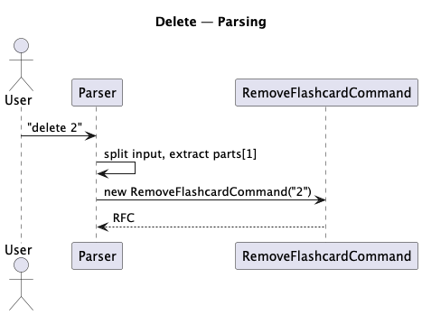

# Developer Guide

## Acknowledgements

{list here sources of all reused/adapted ideas, code, documentation, and third-party libraries -- include links to the original source as well}

## Design & implementation

{Describe the design and implementation of the product. Use UML diagrams and short code snippets where applicable.}
### Overall design
- class `QuizMos`: run the program loop, implement `FlashcardList` and `Storage`
- class `Ui`: define printing formats (announcements, errors,...)
- class `Storage`: store and load flashcards
- class `Parser`: parse raw user's command to suitable `Command` object
- package `common`: include `Messages` class (for general messages) and other classes store messages for features
- package `command`: include different classes for each command to execute

---

### Adding a Flashcard Feature

#### Overview

The Add Flashcard feature allows users to create new flashcards with a question and an answer.
The user inputs a command in the following format:

```bash
add q/<QUESTION> a/<ANSWER>
```


For example:
```bash
add q/What is Java? a/A programming language.
```

This feature is made possible by the following components:

- **Storage**: Persists flashcards to a local text file.
- **Parser**: Parses user input and extracts question/answer text.
- **AddFlashcardCommand**: Creates a new flashcard and adds it to the FlashcardList.
- **FlashcardList**: Stores and manages the collection of flashcards.
- **Ui**: Displays confirmation and feedback messages to the user.

---

#### Step 1. Parsing the Add Command

When a user enters an `add` command, the `Parser` class:
1. Detects `"add"` as the command keyword.
2. Extracts the `q/` and `a/` arguments.
3. Creates a new `AddFlashcardCommand` object with the parsed question and answer.


---

#### Step 2. Executing the Add Command

When executed:
1. `AddFlashcardCommand` creates a new `Flashcard` with the parsed data.
2. Adds it to the `FlashcardList`.
3. Calls `Storage.writeToFile()` to persist the change.
4. Uses `Ui.showFlashcardAdded()` to confirm the addition.


---

#### Full Class Diagram for Implementation of Add Feature


---

### Delete Flashcard Feature

#### Overview

The **Delete Flashcard** feature allows users to remove flashcards from the list by specifying their 1-based index:
```bash
delete INDEX
```

This command deletes the flashcard at INDEX in the current list (if the index is valid). 

Components involved:

- **Parser** — recognises `delete` and extracts the index argument.
- **RemoveFlashcardCommand** — validates the index and performs the removal.
- **FlashcardList** — holds and mutates the collection of flashcards.
- **Storage** — persists the updated list to disk.
- **Ui** — informs the user about success or invalid index.

---

#### Step 1 — Parsing the Delete Command

When the user types `delete 2`:

1. `Parser` splits the input and identifies the command keyword `delete`.
2. `Parser` extracts the index argument (here, `"2"`).
3. `Parser` constructs a `RemoveFlashcardCommand` with the raw argument (string or parsed index depending on design).



---

#### Step 2 — Parsing the Delete Command

When the `RemoveFlashcardCommand` executes:

1. The command attempts to parse/validate the index:
- convert to integer (one-based), convert to zero-based.
- if parse fails or index out of range → call `Ui.invalidIndexRespond()` and abort.
2. If valid:
- retrieve the flashcard from `FlashcardList`.
- remove it from `FlashcardList`.
- call `Storage.writeToFile(flashcards)` to persist the change.
- call `Ui.showFlashcardRemoved(deletedFlashcard)` to inform the user.


---

#### Full Class Diagram for Remove Feature


---

### Search Flashcard Feature

#### Overview

The **Search Flashcard** feature finds and lists flashcards whose question or answer contains a given keyphrase.

Command form:

```bash
search <KEYPHRASE>
```

Example:

```bash
search Java
```

When executed, the program searches through all flashcards and displays only those that contain the keyword in either the question or the answer.

Components Involved

- **Parser** — recognizes the `search` command and extracts the keyphrase.
- **SearchFlashcardCommand** — performs the actual search logic.
- **FlashcardList** — provides access to all flashcards.
- **Ui** — displays search results or a message if no matches are found.

---

#### Step 1 — Parsing the Search Command

When the user enters:
```bash
search Java
```

The `Parser` class:
1. Identifies `search` as the command keyword.
2. Extracts `"Java"` as the keyphrase argument.
3. Creates a new `SearchFlashcardCommand("Java")`.


---

#### Step 2 — Executing the Search Command

When executed, the `SearchFlashcardCommand` performs the following steps:

1. Creates a new, empty `FlashcardList` called `matches`.
2. Iterates through all flashcards in the main list.
3. Checks whether each flashcard’s **question** or **answer** contains the keyphrase.
4. If a match is found, it is added to `matches`.
5. After iterating through all flashcards:
- If `matches` is empty → calls `Ui.noMatchesRespond()`.
- Otherwise → calls `matches.showList()` to display the results.


---

#### Full Class Diagram for Remove Feature


---

### Starring Flashcards Feature

#### Overview

The starring feature allows users to **mark important flashcards** as “starred” for easier review. A starred flashcard is indicated by the `isStarred` attribute in the `Flashcard` class.

This feature is made possible by the following components:

- **Storage**: Handles reading and writing flashcards (including their `isStarred` status) from and to a text file.
- **Flashcard**: Represents a single flashcard, with an additional `isStarred` attribute and `toggleStar()` method.
- **FlashcardList**: Manages a list of flashcards.
- **Parser**: Parses user input and creates corresponding `Command` objects.
- **StarCommand**: Toggles the `isStarred` status of a flashcard at the specified index.
- **UI**: Displays the result of starring actions to the user.
- **Message**: Stores user-facing message templates.

---

#### Step 1. Loading Flashcards from File

When the user starts the application, the `Storage` class loads flashcards from a text file.  
Each line in the file follows the format:

`Question | Answer | Starred`


or

`Question | Answer |`


The `Storage#load()` method:

1. Reads each line.
2. Splits it by `|`.
3. Creates a new `Flashcard` instance.
4. Sets `isStarred` to `true` if the third part equals `"Starred"`.
5. Adds the `Flashcard` to a `FlashcardList`.


---

#### Step 2. Parsing the Star Command

When a user enters:

`star 3`

The `Parser` class:

1. Identifies that the command keyword is `"star"`.
2. Extracts the index argument (`3`).
3. Creates a new `StarCommand(index)` instance.


---

#### Step 3. Executing the Star Command

When executed, the `StarCommand`:

1. Retrieves the `Flashcard` from the `FlashcardList` at the specified index.
2. Calls the flashcard’s `toggleStar()` method to flip its status.
3. Calls `UI#showStarredFlashcard(flashcard)` to display the confirmation message.


---

#### Step 4. Saving Updated Flashcards

After the star operation, the application calls `Storage#save()` to persist the updated flashcard states.

The `Storage#save()` method:

1. Iterates through each flashcard in the list.
2. Writes its question, answer, and `"Starred"` (if `isStarred` is true) back to the text file.


---

#### Full Class Diagram for Implementation of Starring Feature


---

### Feature: review
- If `Parser` detects `review` command, it creates a `ReviewCommand` instance
- The `ReviewCommand` instance gets the raw command to define its review mode (an `IReviewMode` instance)
- The `ReviewCommand` instance run the review loop:
  - display question (`displayQuestion`)
  - prompt user's answer (`getPrompt()`)
  - check that answer (`checkAnswer()`)
- Each IReviewMode instance override the 3 functions to fit its function


## Product scope

### Target user profile

- Busy students
- Students that want to study their materials buy active recall

### Value proposition

{Describe the value proposition: what problem does it solve?}

## User Stories

| Version | As a... | I want to... | So that I can... |
| :--- | :--- | :--- | :--- |
| v1.0 | new user | go through a series of instructions | refer to them when I forget how to use the application |
| v1.0 | new user | see usage instructions | I know how to use the app |
| v1.0 | user | view list of flashcards overall | I can see every flashcard created |
| v1.0 | user | remove flashcards | I can keep my deck organized and make sure unnecessary cards are removed |
| v1.0 | user | add a flashcard with a question and answer | I can revise the material later |
| v1.0 | user | save my flashcards locally | I can reuse flashcards |
| v1.0 | user | do review | I can review my knowledge |
| v2.0 | user | find a to-do item by name | locate a to-do without having to go through the entire list |
| v2.0 | user | star/flag flash cards which are important | I can review by categories |
| v2.0 | new user | add the list of flashcards through a txt file | I start using the app more quickly |
| v2.0 | user | add multiple choice type questions | I can test my knowledge in different ways |
| v2.0 | user | add true/false type questions | I can test my knowledge in different ways |
| v2.0 | user | search for a specific flashcard by keyword | I can quickly find and revise a concept |
| v2.0 | user | mark my answers as correct or incorrect during quizzes | the app can track my progress |

## Non-Functional Requirements

{Give non-functional requirements}

## Glossary

* *glossary item* - Definition

## Instructions for manual testing

{Give instructions on how to do a manual product testing e.g., how to load sample data to be used for testing}
